[Основные Токены](https://github.com/Kobold47/Dnd-Tokens-2/blob/main/images_mark/README.md) |
[Иконки](https://github.com/Kobold47/Dnd-Tokens-2/blob/main/images_icons/README.md) |
[Эффекты](https://github.com/Kobold47/Dnd-Tokens-2/blob/main/images_sfx/README.md) |
[Музыка](https://github.com/Kobold47/Dnd-Tokens-2/blob/main/music/) |
[Карты](https://github.com/Kobold47/Dnd-Tokens-2/blob/main/images_maps/README.md) |
[Арты](https://github.com/Kobold47/Dnd-Tokens-2/blob/main/images_arts/README.md) |
<table><tr>
<tr>
<td valign="bottom">
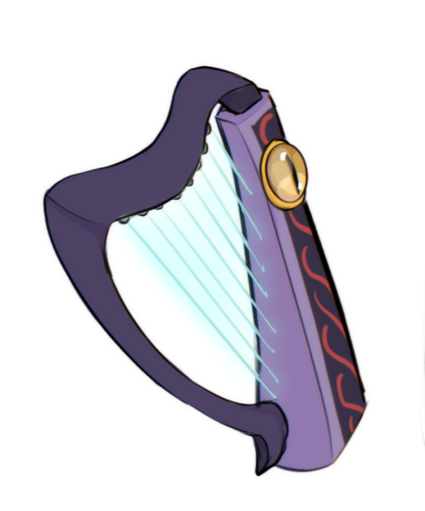 
5602_1_1684678088.png
</td>

<td valign="bottom">
 
Aberration.png
</td>

<td valign="bottom">
 
Air.png
</td>

<td valign="bottom">
 
AKS.png
</td>

<td valign="bottom">
 
Alfon.png
</td>

<td valign="bottom">
 
Anri.png
</td>

</tr>
<tr>
<td valign="bottom">
 
Artur.png
</td>

<td valign="bottom">
 
Bean-Blank.png
</td>

<td valign="bottom">
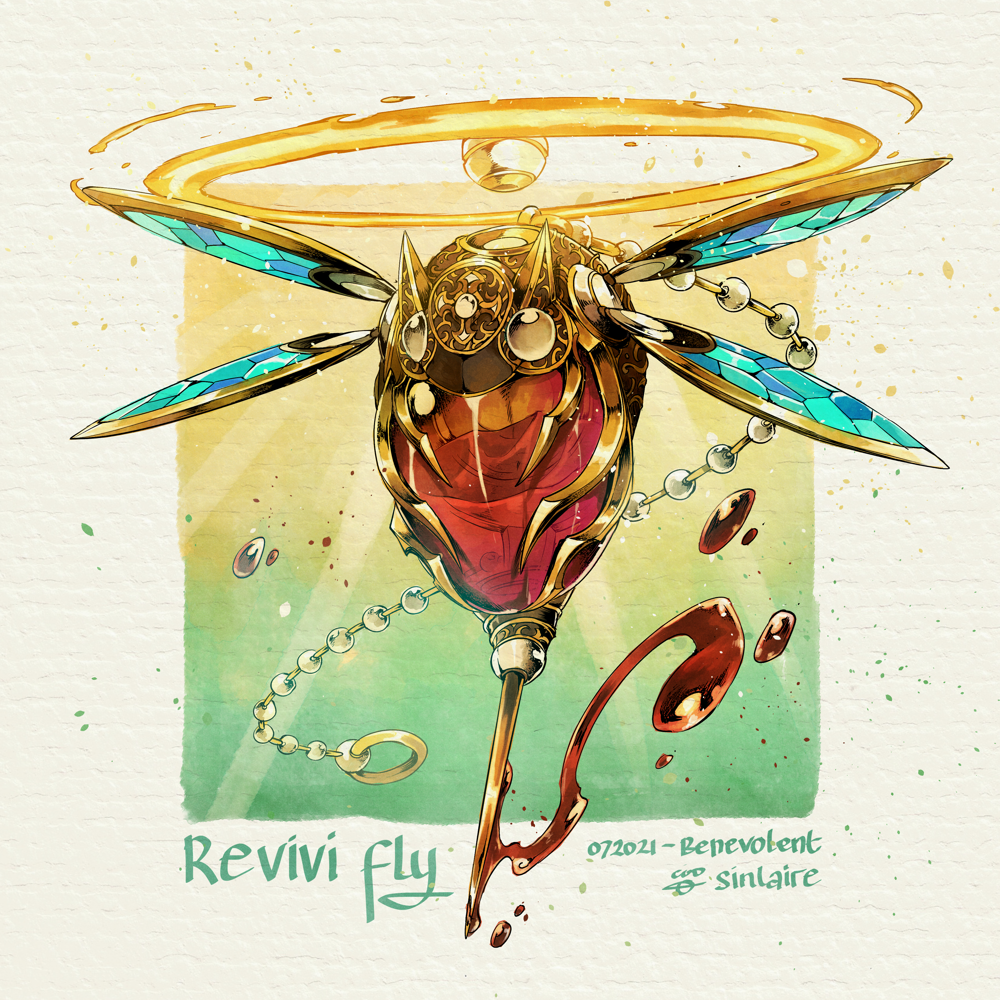 
Benevolent.jpg
</td>

<td valign="bottom">
 
Berserker (1).png
</td>

<td valign="bottom">
 
Bieshra.png
</td>

<td valign="bottom">
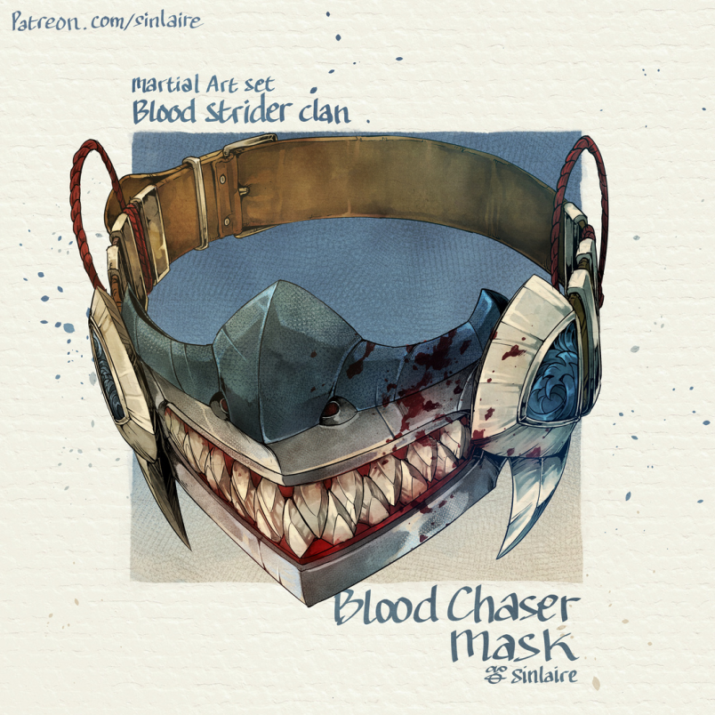 
BloodChaser.png
</td>

</tr>
<tr>
<td valign="bottom">
 
BlueFire.png
</td>

<td valign="bottom">
 
book (1).jpg
</td>

<td valign="bottom">
 
book (2).jpg
</td>

<td valign="bottom">
 
book (3).jpg
</td>

<td valign="bottom">
 
book (4).jpg
</td>

<td valign="bottom">
 
book (5).jpg
</td>

</tr>
<tr>
<td valign="bottom">
 
book (6).jpg
</td>

<td valign="bottom">
 
book (7).jpg
</td>

<td valign="bottom">
 
b_04.png
</td>

<td valign="bottom">
 
b_08.png
</td>

<td valign="bottom">
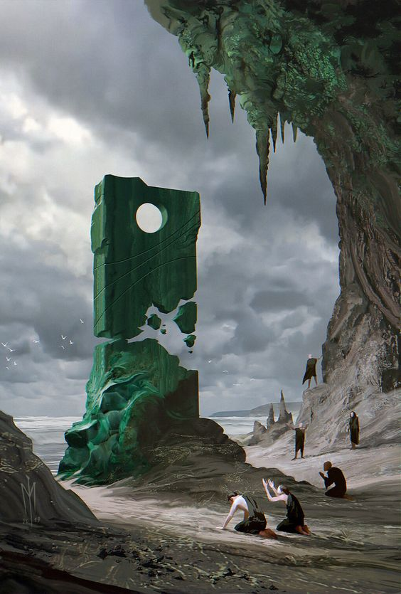 
c7538c6cb348b68f0e09599f3b22d267.jpg
</td>

<td valign="bottom">
 
CHATO.png
</td>

</tr>
<tr>
<td valign="bottom">
 
CH_Memory.png
</td>

<td valign="bottom">
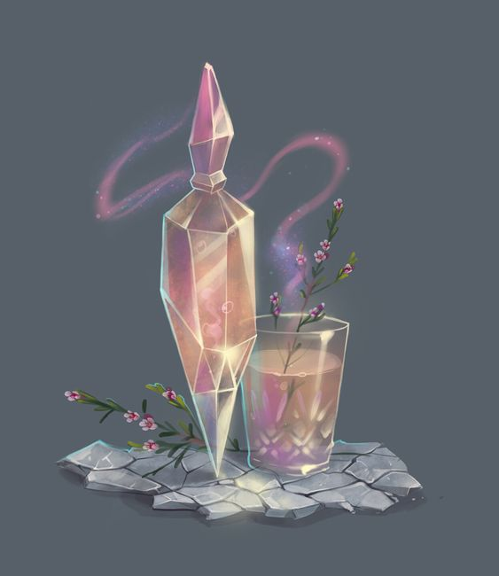 
d1a8161a560df7fb61a25cff0e157800.jpg
</td>

<td valign="bottom">
 
Dazzaz.png
</td>

<td valign="bottom">
 
DSCF9890.png
</td>

<td valign="bottom">
 
DSCF9892.png
</td>

<td valign="bottom">
 
elis.png
</td>

</tr>
<tr>
<td valign="bottom">
 
exeArmor (2).png
</td>

<td valign="bottom">
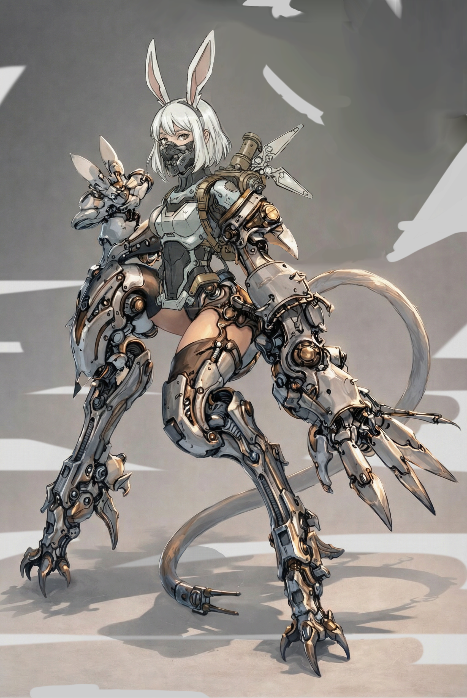 
EXEArmor.png
</td>

<td valign="bottom">
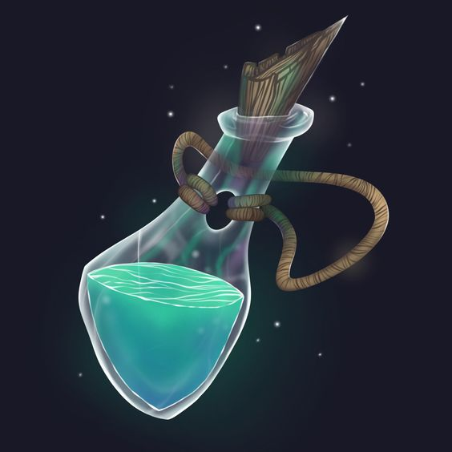 
f012ec42368285d695f6b4689f9183af.jpg
</td>

<td valign="bottom">
 
Faunalin.png
</td>

<td valign="bottom">
 
Felizia.png
</td>

<td valign="bottom">
 
FhaKdHnakAAtX4I.webp
</td>

</tr>
<tr>
<td valign="bottom">
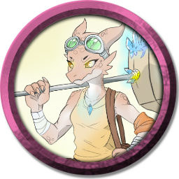 
Flora.png
</td>

<td valign="bottom">
 
Frencesco.png
</td>

<td valign="bottom">
 
genrih.png
</td>

<td valign="bottom">
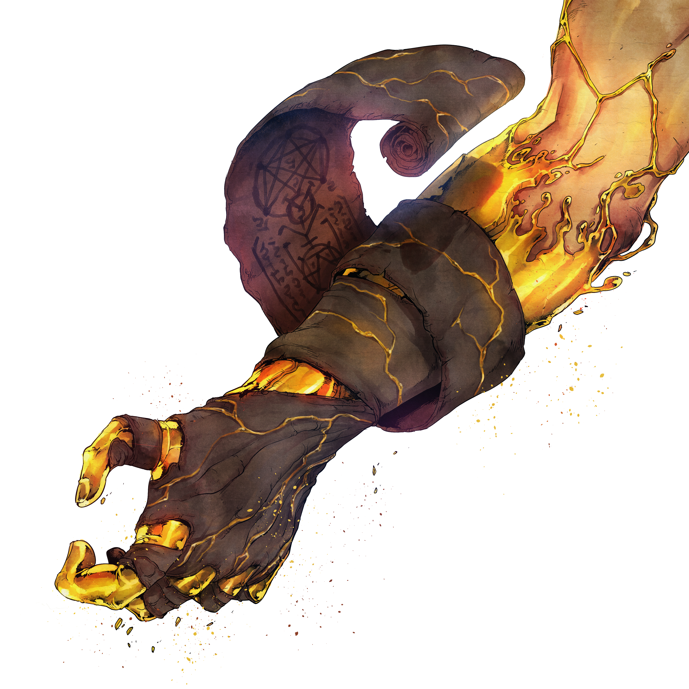 
Greed.png
</td>

<td valign="bottom">
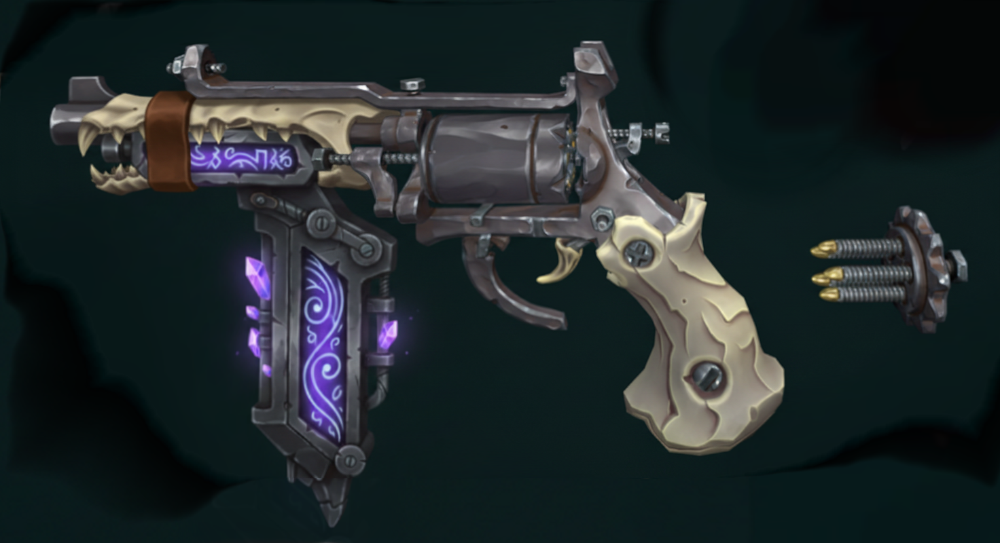 
GunSkill.png
</td>

<td valign="bottom">
 
Hans.png
</td>

</tr>
<tr>
<td valign="bottom">
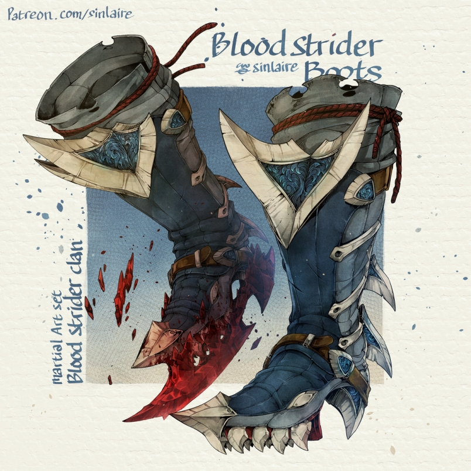 
HeadStriger.png
</td>

<td valign="bottom">
 
Hollow-Blank .png
</td>

<td valign="bottom">
 
Image048 (1).png
</td>

<td valign="bottom">
 
Image049 (1).png
</td>

<td valign="bottom">
 
Image093.png
</td>

<td valign="bottom">
 
Image094.png
</td>

</tr>
<tr>
<td valign="bottom">
 
Image095.png
</td>

<td valign="bottom">
 
Image096.png
</td>

<td valign="bottom">
 
Image097.png
</td>

<td valign="bottom">
 
Image098.png
</td>

<td valign="bottom">
 
Image099.png
</td>

<td valign="bottom">
 
Image100.png
</td>

</tr>
<tr>
<td valign="bottom">
 
jasmine.png
</td>

<td valign="bottom">
 
Lifh.png
</td>

<td valign="bottom">
 
misae.png
</td>

<td valign="bottom">
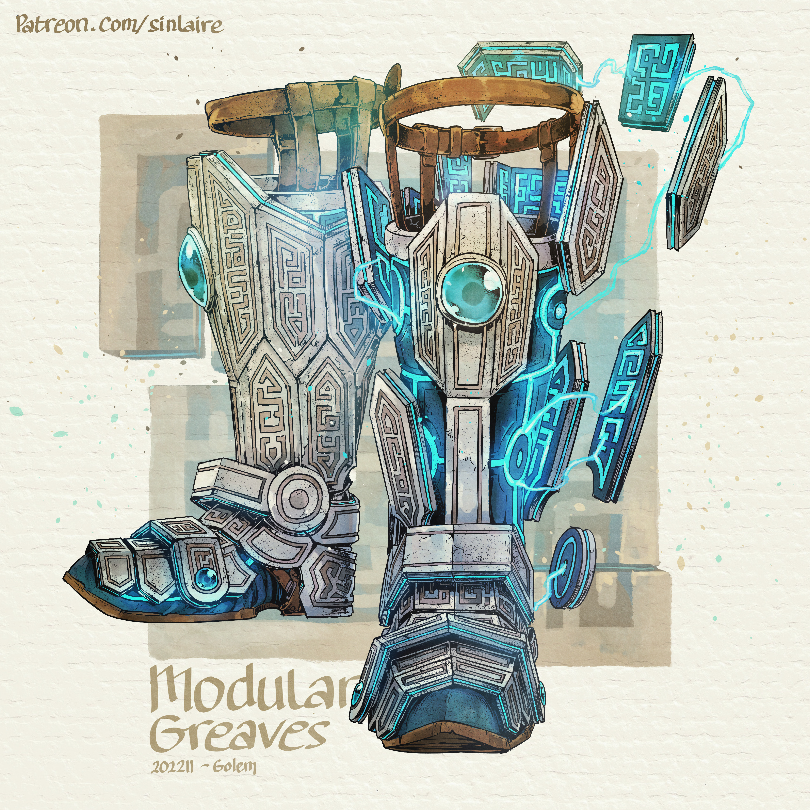 
Modular.jpg
</td>

<td valign="bottom">
 
NERET.png
</td>

<td valign="bottom">
 
Niirdal-Sarqet_-_Clara.png
</td>

</tr>
<tr>
<td valign="bottom">
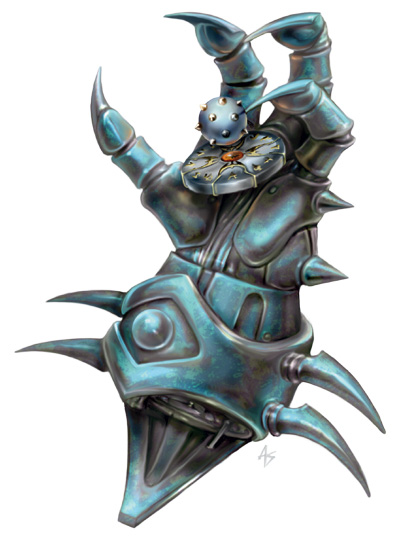 
Oculus.png
</td>

<td valign="bottom">
 
Order_moon.png
</td>

<td valign="bottom">
 
preview (101).png
</td>

<td valign="bottom">
 
preview (102).png
</td>

<td valign="bottom">
 
preview (102)2.png
</td>

<td valign="bottom">
 
preview (111).png
</td>

</tr>
<tr>
<td valign="bottom">
 
preview (118).png
</td>

<td valign="bottom">
 
preview (124).png
</td>

<td valign="bottom">
 
preview (125).png
</td>

<td valign="bottom">
 
preview (135).png
</td>

<td valign="bottom">
 
preview (137).png
</td>

<td valign="bottom">
 
preview (15).png
</td>

</tr>
<tr>
<td valign="bottom">
 
preview (89).png
</td>

<td valign="bottom">
 
preview (94).png
</td>

<td valign="bottom">
 
preview (96).png
</td>

<td valign="bottom">
 
preview (98).png
</td>

<td valign="bottom">
 
Primordial Giant - Replica.png
</td>

<td valign="bottom">
 
Prosthetic.png
</td>

</tr>
<tr>
<td valign="bottom">
 
razmaria.png
</td>

<td valign="bottom">
 
Rein.png
</td>

<td valign="bottom">
 
Rozzark.png
</td>

<td valign="bottom">
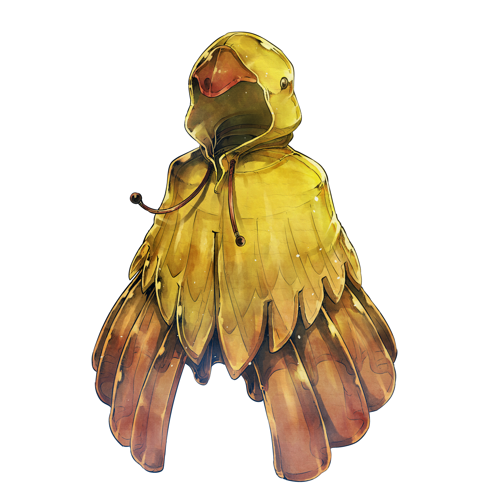 
Rubber.png
</td>

<td valign="bottom">
 
r_03.png
</td>

<td valign="bottom">
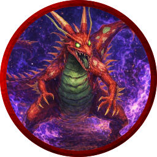 
salamandra.png
</td>

</tr>
<tr>
<td valign="bottom">
 
Sarfir.png
</td>

<td valign="bottom">
 
scroll_b_02.png
</td>

<td valign="bottom">
 
Seven.png
</td>

<td valign="bottom">
 
shatter.png
</td>

<td valign="bottom">
 
Spark_Container.png
</td>

<td valign="bottom">
 
SP_DRON.png
</td>

</tr>
<tr>
<td valign="bottom">
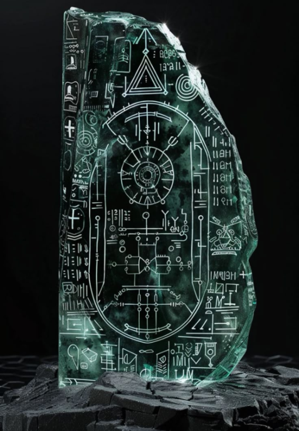 
Tablet.png
</td>

<td valign="bottom">
 
Tekutli.png
</td>

<td valign="bottom">
 
thaumaturgy.png
</td>

<td valign="bottom">
 
thunderwave.png
</td>

<td valign="bottom">
 
TikTik.png
</td>

<td valign="bottom">
 
token_1 (51).png
</td>

</tr>
<tr>
<td valign="bottom">
 
token_1 (52).png
</td>

<td valign="bottom">
 
token_1 (53).png
</td>

<td valign="bottom">
 
token_1(2).png
</td>

<td valign="bottom">
 
token_1(3).png
</td>

<td valign="bottom">
 
token_2(1).png
</td>

<td valign="bottom">
 
token_3(1).png
</td>

</tr>
<tr>
<td valign="bottom">
 
token_4(1).png
</td>

<td valign="bottom">
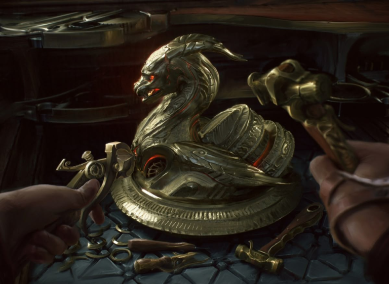 
Turel.png
</td>

<td valign="bottom">
 
Tzoncamatl.png
</td>

<td valign="bottom">
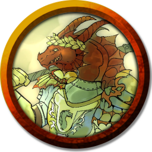 
Venced.png
</td>

<td valign="bottom">
 
viliam.png
</td>

<td valign="bottom">
 
Zirrit.png
</td>

</tr>
<tr>
<td valign="bottom">
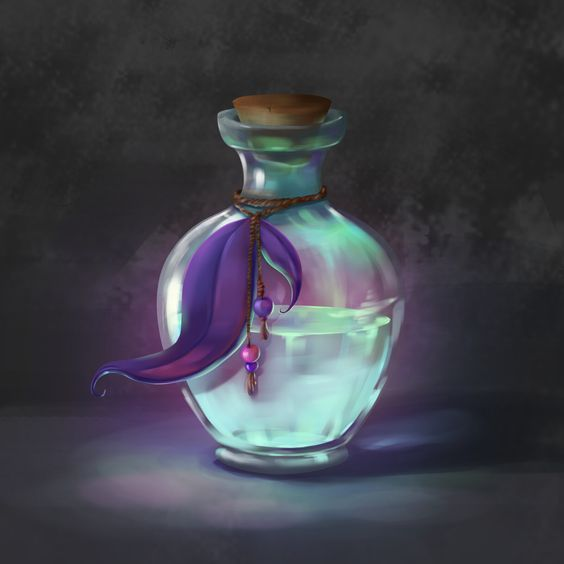 
апра.jpg
</td>

</tr></table>